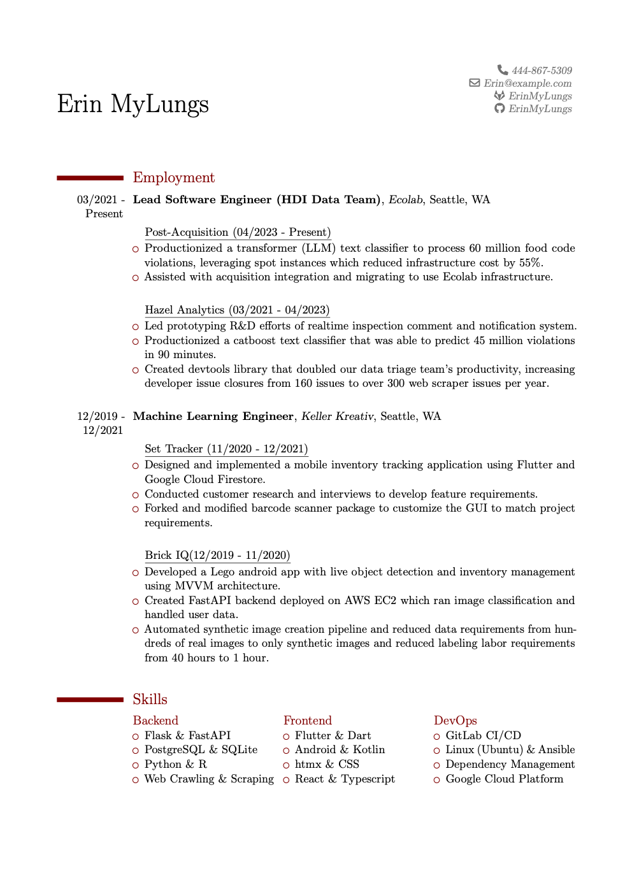

# Erin's Resume in LaTeX

A basic modular resume repo setup in LaTeX. `example_resume_output.pdf` contains an example resume with faked contact info.

## Structure
* `resume.tex` - 
  * This imports each section and sets styling options.
  * Look at [moderncv](https://github.com/xdanaux/moderncv) for specifics to tweak.
* `contact` - contains contact info
  * I have variants with more or less personal info depending on where I'm posting my resume.
* `employment` - contains employment history
  * `employment_section.tex` imports each individual job section
  * `jobs/`
    * Job descriptions go here, typically with `\cventry{}` or `\cvitem` commands.
  * `skills` - contains skill lists
    * `skills_section.tex` selects specific skill lists to include as columns
      * These are basic `\begin{itemize}` lists

## How to run (bootstrap procedure)
* Clone repo
* Install [funky](https://github.com/bbugyi200/funky) via `pipx install pyfunky`
  * For reals, it's amazing and I use it constantly.
* Install [podman](https://podman.io/) or docker. This probably works with an `alias podman=docker` but whatever.
* Run `build && compile` from repo root and you should have a `resume.pdf` file which matches the `example_resume_output.pdf` file

### References & resources

The Dockerfile is a modified version of the [dev container example](https://github.com/James-Yu/LaTeX-Workshop/blob/master/samples/docker/.devcontainer/Dockerfile) given for the LaTeX-Workshop VS code plugin. I need to streamline the dependencies because right now the image takes up 2.77gb of space but I think that can get trimmed down.

[The perfect VS code + Docker + LaTeX setup](https://medium.com/@kombustor/vs-code-docker-latex-setup-f84128c6f790) which I used to set up this environment originally.